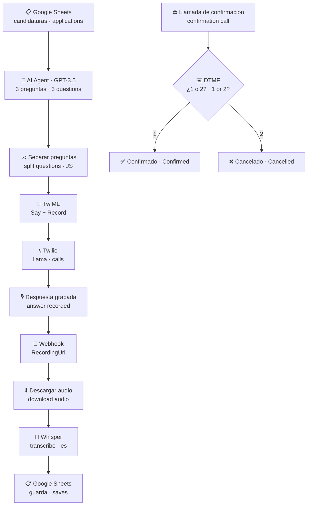

<h1 align="center">Entrevistador telefónico con IA</h1>
<h3 align="center">AI phone interviewer</h3>

  <b>Un agente que llama por teléfono, entrevista al candidato y transcribe sus respuestas.</b> 
  <i>An agent that calls the candidate, interviews them and transcribes their answers.</i>

  
  
  

> 🇪🇸 **Español** primero, 🇬🇧 **English** debajo en gris. La versión de referencia es la española. 
> <i>Spanish first, English underneath in grey. The Spanish version is the reference one.</i>

---

## 🎯 El problema · The problem

El primer filtro de una candidatura es casi siempre el mismo: tres preguntas básicas para saber si merece la pena una entrevista de verdad. Con cincuenta candidatos, eso son cincuenta llamadas de cinco minutos que alguien tiene que hacer, y cincuenta veces las mismas notas escritas a mano.

<i>The first screening round is almost always the same: three basic questions to find out whether a real interview is worth it. With fifty candidates that's fifty five-minute calls someone has to make, and the same notes written by hand fifty times.</i>

## 💡 La solución · The solution

1. Lee los candidatos desde el **formulario de candidatura** (Google Sheets). · <i>It reads candidates from the application form in Google Sheets.</i>
2. Un **agente de IA genera tres preguntas** específicas para el puesto de esa persona, no un guion fijo. · <i>An AI agent generates three questions specific to that person's role — not a fixed script.</i>
3. Las preguntas se convierten en **TwiML** y **Twilio llama al candidato**, las lee con voz sintética en español y graba su respuesta. · <i>The questions become TwiML, Twilio calls the candidate, reads them out in Spanish and records the answer.</i>
4. El audio vuelve por webhook, se descarga y **Whisper lo transcribe** (forzado a español, `temperature: 0`). · <i>The audio comes back via webhook, is downloaded and transcribed by Whisper (forced to Spanish, `temperature: 0`).</i>
5. La transcripción se **guarda en la hoja**, junto a la fila del candidato. · <i>The transcript is saved to the sheet, next to the candidate's row.</i>

Hay además una rama de **confirmación por DTMF**: el sistema llama y pide *"pulsa 1 para confirmar, 2 para cancelar"*, y bifurca según la tecla.

<i>There is also a DTMF confirmation branch: the system calls and asks "press 1 to confirm, 2 to cancel", then branches on the key.</i>

## ⚙️ Cómo funciona · How it works

Lo interesante no es la llamada: es que **el TwiML se genera en tiempo de ejecución** a partir de las preguntas que acaba de escribir el modelo. El guion de la entrevista se escribe solo, para cada candidato, en el mismo momento en que suena el teléfono.

<i>The interesting part isn't the call: it's that the TwiML is generated at runtime from the questions the model has just written. The interview script writes itself, per candidate, the moment the phone rings.</i>

## 🧰 Stack

| Capa · Layer | Herramienta · Tool |
|---|---|
| Orquestación · Orchestration | n8n (webhooks, funciones JS, switch, IF) |
| Telefonía · Telephony | Twilio Voice · TwiML (`Say`, `Record`, `Gather`) |
| IA · AI | OpenAI GPT-3.5 (preguntas · questions) · Whisper (transcripción · transcription) |
| Datos · Data | Google Sheets |
| Exposición local · Local tunnel | ngrok |

## 🚀 Reproducirlo · Run it yourself

1. Importa `entrevistador_ia.json` en n8n. · <i>Import `entrevistador_ia.json` into n8n.</i>
2. Sustituye los placeholders · <i>Replace the placeholders:</i>
   - `YOUR_TWILIO_NUMBER` y `+34XXXXXXXXX` → tus números · <i>your numbers</i>
   - `YOUR_GOOGLE_SHEET_ID` → el ID de tu hoja · <i>your sheet ID</i>
   - `your-ngrok-url.ngrok-free.app` → tu URL pública · <i>your public URL</i>
3. Reconecta las credenciales de Twilio, OpenAI y Google Sheets. · <i>Reconnect the Twilio, OpenAI and Google Sheets credentials.</i>
4. Apunta el webhook de grabación de Twilio a `/webhook/webhook-whisper`. · <i>Point Twilio's recording webhook to `/webhook/webhook-whisper`.</i>

> El export está **sanitizado**: sin credenciales, SIDs, teléfonos reales ni IDs de hojas. 
> <i>The export is sanitised: no credentials, SIDs, real phone numbers or sheet IDs.</i>

## ⚠️ Limitaciones conocidas · Known limitations

- **El estado entre preguntas es frágil**: el contador viaja por query string; con varias llamadas simultáneas se pisan. Lo correcto sería una tabla de sesiones. <i>State between questions is fragile: the counter travels in the query string, so concurrent calls overwrite each other. A sessions table would be the right fix.</i>
- **Twilio corta la grabación a 30–60 s**, así que las respuestas largas se truncan. <i>Twilio caps the recording at 30–60 s, so long answers get cut off.</i>
- **Sin evaluación de las respuestas**: hoy transcribe y guarda. El siguiente paso es puntuar la respuesta contra los requisitos del puesto. <i>No answer scoring yet: it transcribes and stores. The next step is scoring the answer against the role's requirements.</i>

## 👩🏽‍💻 Autora · Author

**Thaís Brandão** — Data Analyst &amp; AI Strategist
[LinkedIn](https://www.linkedin.com/in/thaisbrand%C3%A3o/) · [GitHub](https://github.com/thaisbrandao)
