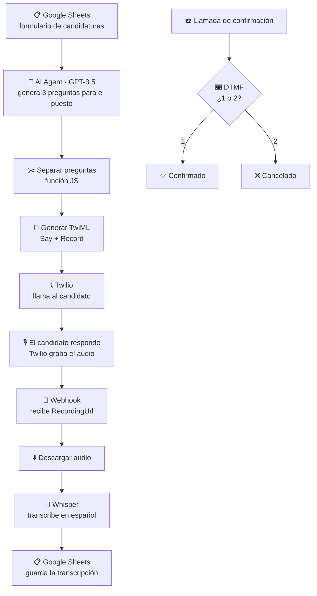

<h1 align="center">Entrevistador telefónico con IA</h1>

  <b>Un agente que llama por teléfono, entrevista al candidato y transcribe sus respuestas</b> 
  <i>De un formulario de candidatura a una entrevista grabada y transcrita, sin intervención humana.</i>

  
  
  

---

## El problema

El primer filtro de una candidatura es casi siempre el mismo: tres preguntas básicas para saber si merece la pena una entrevista de verdad. Con cincuenta candidatos, eso son cincuenta llamadas de cinco minutos que alguien tiene que hacer, y cincuenta veces las mismas notas escritas a mano.

## La solución

Este workflow convierte ese primer filtro en un proceso automático de extremo a extremo:

1. Lee los candidatos desde el **formulario de candidatura** (Google Sheets).
2. Un **agente de IA genera tres preguntas** específicas para el puesto al que se ha apuntado esa persona — no un guion fijo.
3. Las preguntas se convierten en **TwiML** y **Twilio llama al candidato**, las lee con voz sintética en español y graba su respuesta.
4. El audio vuelve por webhook, se descarga y **Whisper lo transcribe** (forzado a español, `temperature: 0`).
5. La transcripción se **guarda en la hoja**, junto a la fila del candidato.

Hay además una rama de **confirmación por DTMF**: antes de la entrevista el sistema llama y pide *"pulsa 1 para confirmar, 2 para cancelar"*, y bifurca según la tecla.

## Cómo funciona

La parte interesante no es la llamada: es que **TwiML se genera en tiempo de ejecución** a partir de las preguntas que acaba de escribir el modelo. El guion de la entrevista se escribe solo, para cada candidato, en el mismo momento en que suena el teléfono.

## Stack

| Capa | Herramienta |
|---|---|
| Orquestación | n8n (webhooks, funciones JS, switch, IF) |
| Telefonía | Twilio Voice · TwiML (`Say`, `Record`, `Gather`) |
| IA | OpenAI GPT-3.5 (generación de preguntas) · Whisper (transcripción) |
| Datos | Google Sheets |
| Exposición local | ngrok |

## Reproducirlo

1. Importa `entrevistador_ia.json` en tu instancia de n8n.
2. Sustituye los placeholders:
   - `YOUR_TWILIO_NUMBER` y `+34XXXXXXXXX` → tus números de origen y destino
   - `YOUR_GOOGLE_SHEET_ID` → el ID de tu hoja de candidatos
   - `your-ngrok-url.ngrok-free.app` → tu URL pública (ngrok o dominio propio)
3. Reconecta las credenciales de Twilio, OpenAI y Google Sheets.
4. Configura el webhook de grabación en Twilio apuntando a `/webhook/webhook-whisper`.

La hoja de candidatos espera columnas de nombre, teléfono y puesto de interés; los nombres exactos están en los nodos de Sheets del blueprint.

> El export está **sanitizado**: no contiene credenciales, SIDs, números de teléfono reales ni IDs de hojas.

## Limitaciones conocidas

Es un prototipo de curso, no un producto:

- **El estado entre preguntas es frágil.** El contador de pregunta viaja por query string; con varias llamadas simultáneas se pisan. Lo correcto sería una tabla de sesiones.
- **Twilio corta la grabación a 30–60 s**, así que las respuestas largas se truncan.
- **Sin evaluación de las respuestas.** Hoy transcribe y guarda; el siguiente paso natural es puntuar la respuesta contra los requisitos del puesto.
- La rama DTMF y la rama de entrevista **conviven en el mismo canvas** y comparten nodos; separarlas en dos workflows haría el flujo mucho más legible.

## Autora

**Thaís Brandão** — Data Analyst & AI Strategist
[LinkedIn](https://www.linkedin.com/in/thaisbrand%C3%A3o/) · [GitHub](https://github.com/thaisbrandao)
# ai-phone-interviewer
Agente en n8n que llama por teléfono al candidato, le hace preguntas generadas por IA y transcribe sus respuestas con Whisper.
